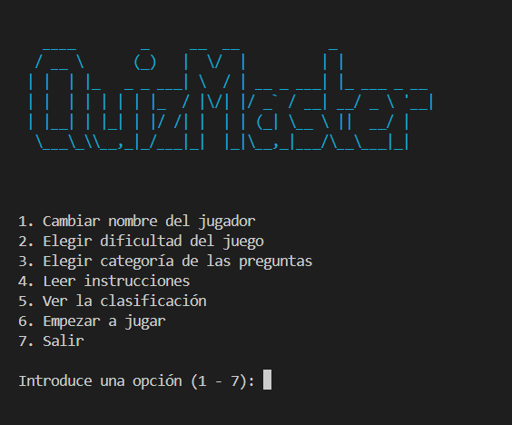
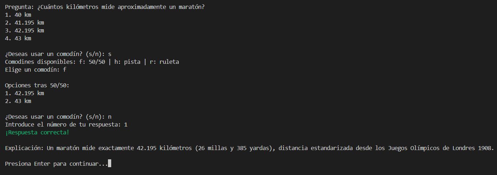
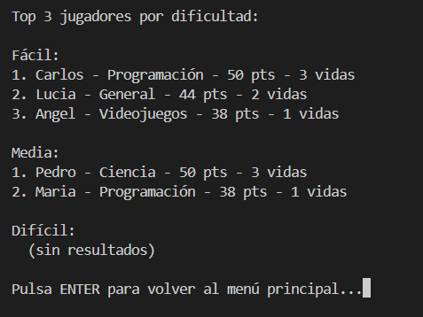

# QuizMaster

A modular quiz game built in Python, designed with a clear separation between core logic and interface layer — allowing the same backend to power a CLI and TUI.

---

## Roadmap

| Version | Interface | Status |
|---------|-----------|--------|
| v1.0.0 | CLI | ✅ Complete |
| v2.0.0 | TUI (Textual) | 🚧 In progress |

---

## Features

- 10 questions per game across 6 categories: General, Science, History, Sports, Video Games, and Programming
- 3 difficulty levels with dynamic score penalties (Easy, Medium, Hard)
- 3 lifelines per game — each single-use:
  - **50/50** — eliminates two incorrect options
  - **Hint** — reveals a clue for the current question
  - **Roulette** — randomly eliminates 0 to 3 incorrect options (intentional risk mechanic)
- Local ranking system — Top 3 per difficulty
- Animated countdown before each game

---

## Screenshots

> CLI (v1.1.0)

<!-- Main menu -->


<!-- In-game question -->


<!-- Ranking screen -->


---

## Project Structure

```
quizmaster/
├── app/
│   ├── models/
│   │   ├── lifelines.py     # FiftyFifty, Hint, Roulette
│   │   ├── player.py        # Player state and scoring
│   │   └── question.py      # Question loading and randomization
│   ├── config.py            # Game constants and file paths
│   ├── game.py              # Core game loop
│   ├── menu.py              # Reusable menu component
│   ├── menus.py             # Menu instances
│   ├── storage.py           # Ranking persistence
│   └── utils.py             # Terminal utilities and ASCII art
├── data/
│   ├── questions/
│   │   ├── easy.json
│   │   ├── medium.json
│   │   └── hard.json
│   └── ranking.json
├── main.py
├── requirements.txt
└── README.md
```

---

## Getting Started

**Requirements:** Python 3.10+

```bash
git clone https://github.com/AngelOrtizTorres/quizmaster.git
cd quizmaster
pip install -r requirements.txt
python main.py
```

---

## Gameplay

1. Enter your name
2. Select a difficulty and category
3. Answer 10 multiple choice questions
   - Enter a number **1 to 4** (or available options after lifelines)
   - The game validates your input and requires a valid option
4. For each question, choose to use a lifeline:
   - Enter **'s'** (yes) to use a lifeline, or **'n'** (no) to skip
5. Use lifelines strategically — once used, they're gone
6. Lose all 3 lives and the game ends early
7. Finish all questions and optionally save your score to the ranking

**Scoring:**

| Result | Points |
|--------|--------|
| Correct answer | +5 |
| Wrong answer — Easy | -1 |
| Wrong answer — Medium | -2 |
| Wrong answer — Hard | -3 |

---

## Design Decisions

- **Interface-agnostic core** — `app/` has no dependency on any interface. CLI and TUI versions import from it without modification.
- **Centralized configuration** — all game constants (points, lives, delays, commands) are defined in `config.py` for easy adjustment without modifying core logic.
- **Input validation** — strict validation ensures users provide correct input types (e.g., numeric answers 1-4, confirmation as 's' or 'n').
- **Encapsulated lifelines** — each lifeline is its own class, keeping state and behavior isolated.
- **Roulette mechanic** — eliminating 0 options is a valid outcome by design; the uncertainty is the point.
- **JSON persistence** — no database dependency for a local game; keeps the project self-contained.

---

## Dependencies

- [colorama](https://pypi.org/project/colorama/) — cross-platform terminal colors
- [typeguard](https://pypi.org/project/typeguard/) — runtime type checking

---

## License

MIT — see [LICENSE](LICENSE) for details.

---

*Ángel Ortiz Torres*